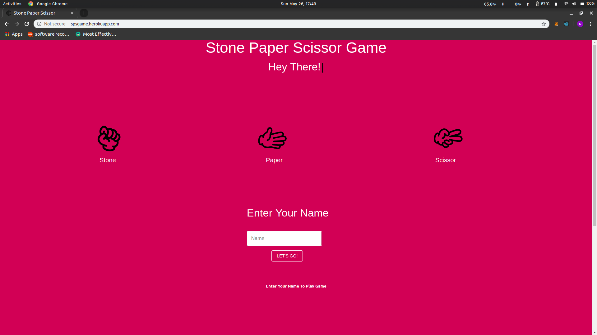
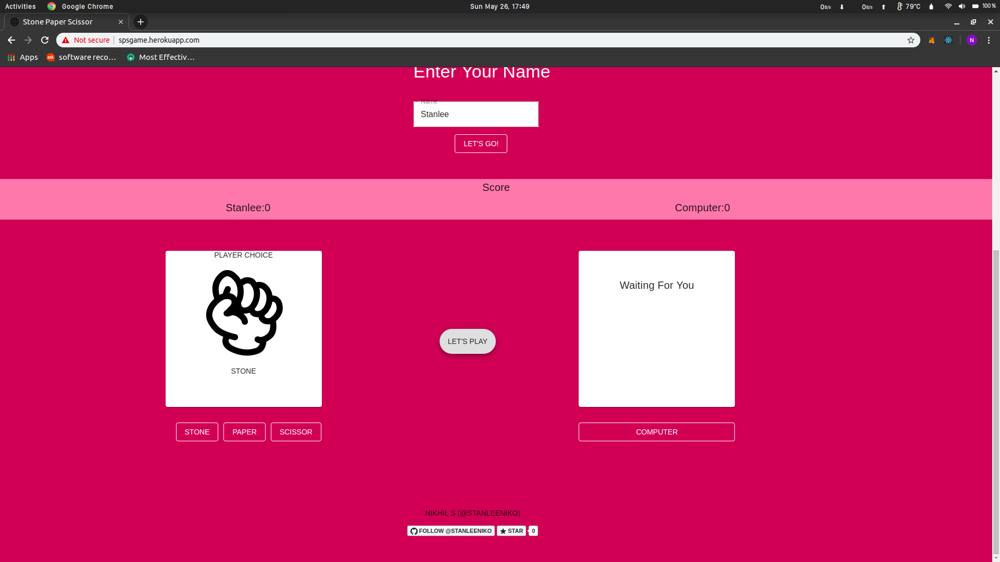
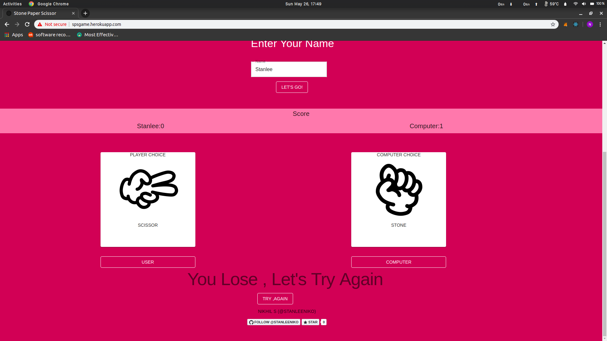

# Stone Paper Scissor Game

                   

This Simple Implementation of Stone Paper Scissor Game

You vs Computer

- It is Deployed to [Heroku](http://spsgame.herokuapp.com/)
- This project was bootstrapped with [Create React App](https://github.com/facebook/create-react-app).
    
   
   
   
   
  
        
       
  
  

## How To Play

#### Enter Your Name
 

#### Choose

#### Go

- Computer will randomly generate its choice.
- Result will be shown .
- Simultaneously Score will be updated.

## How to Use ?

- Clone Repo using

  > git clone https://github.com/stanleeniko/Stone-Paper-Scissors.git

- Inside Project Directory
- Install Dependencies

  > npm install

- Runs the app in the development mode.

  > npm start

- Open http://localhost:3000 to view it in the browser.
- The page will reload if you make edits.
- You will also see any lint errors in the console.

## License

MIT &copy; Nikhil Sahu
